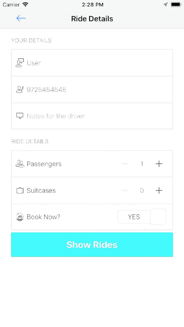
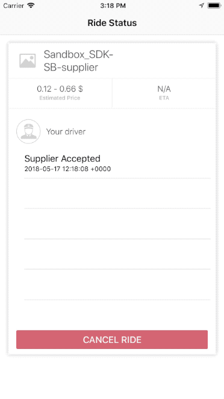

# HERE Mobility SDK iOS - Sample App

## Introduction

HERE Mobility offers a mobility platform solution to transportation service providers, businesses, and consumers. The platform consists of the HERE Mobility Marketplace and SDK packages.

The HERE Mobility Marketplace is a "broker" between transportation suppliers and consumers, which matches up ride requests with ride offers. The HERE Mobility SDK enables developers to create apps with a variety of mobility features, while connecting to the HERE Mobility Marketplace.

The Here Mobility sample app (described below) presents a simple workflow for adding a variety of mobility services to your app.

## SDK Kits

To implement the HERE Mobility Sample App, you will need to use the following development kits:

Name | Description | Documentation
:-----|:-------------|:---------------
Map Kit | Provides map services such as geo-coding | [https://heremobilitydevelopers.github.io/Here-Mobility-SDK-iOS/HereSDKMapKit](https://heremobilitydevelopers.github.io/Here-Mobility-SDK-iOS/HereSDKMapKit)
Demand Kit | Allows passengers (demand-side users) to request and book rides | [https://heremobilitydevelopers.github.io/Here-Mobility-SDK-iOS/HereSDKDemandKit](https://heremobilitydevelopers.github.io/Here-Mobility-SDK-iOS/HereSDKDemandKit)

## Getting Started

### Getting Access Credentials

To use the HERE Mobility SDK, you'll need App ID key and App secret key values.
To request these credentials, contact us at [mobility_developers@here.com]().

### Cloning the Sample App Git Repository

In a Bash command window, clone the Sample App Git repository as follows:

```bash
# Clone this repository
$ git clone https://github.com/HereMobilityDevelopers/Here-Mobility-SDK-iOS-SampleApp.git
# Run pod update
$ pod update
# Set HereMobilitySDKAppId & HereMobilitySDKAppSecret at Info.plist
# Run sampleApp.xcworkspace
```

## The Sample App

Here is an overview of the workflow for booking a ride and monitoring its progress, using the HERE Mobility SDK.
Click on a step name to go to its corresponding code example.

|Step | Description
|:----|:------------
|[Forward geocoding](#forward-geocoding) | Retrieve the geo-location for an address or place name
|[Get the ride route](#get-ride-routes) | Get the ride's route, based on its start and end locations
|[Get ride offers](#get-ride-offers) | Get ride offers from public or private ride suppliers
|[Book a ride](#book-a-ride)| Book one of the ride offers received
|[Register for ride updates](#register-for-ride-updates) | Register for updates about the ride's progress

### Forward Geocoding

The HERE SDK Map Kit supports forward geocoding and reverse geocoding.
Forward geocoding is the conversion of a street address or place name to a geo-location (latitude/longitude pair).
Reverse geo-coding is the conversion of a geo-location (latitude/longitude pair) to addresses or place names near the given geo-location.


The following code snippet shows how to query for a geocoding result, based on a query string and location coordinates.


```swift
func requestGeocodeResults(query: String) {
guard let lastLocation = lastLocation else { return }
mapService.geocodeQuery(query,
forlocation: lastLocation,
resultType: .place,
countryCode: "") { [weak self] (results, error) in
if error != nil {
// handle error
}
else {
// handle geocode result
}
}
}
```

### Get Ride Routes

In the HERE SDK Map Kit, routes are represented by "polylines", which are lines composed of multiple, connected straight-line segments. A route's polyline originates from the ride's start location and ends at the ride's destination location, optionally going through additional "waypoint" locations.

The following code snippet shows how to retrieve routes with the given start and end locations.


```swift
if let originGeocodeResult = self.originGeocodeResult, let destinationGeocodeResult = self.destinationGeocodeResult{
let startLocation = CLLocation(latitude: originGeocodeResult.center.latitude , longitude: originGeocodeResult.center.longitude)
let endLocation = CLLocation(latitude: destinationGeocodeResult.center.latitude , longitude: destinationGeocodeResult.center.longitude{
if let routeRequest = HereSDKRouteRequest(points: [startLocation, endLocation]){
mapService.getRoutesWith(routeRequest, andHandler: {  [weak self] routes, error in
if (error == nil){
if let firstRoute = routes?.first{
// handle route
}
}
else{
// handle error
}
})
}
}

```

### Get Ride Offers

The HERE SDK Demand Kit allows you to request ride offers based on various parameters.



#### Get full address data based on geocode address ID

```swift
mapService.getAddressData(withAddressId: originAddressId, andHandler: { (addressData, error) in
if (error != nil){
// handle error
}
else{
// handle address data
}
})
```

#### Create ride route based on pickup and destination locations

```swift
let originDemandLocation = HereSDKDemandLocation(location: originCLLocation,
address: originAddressData,
freeText: nil)
let destinationDemandLocation = HereSDKDemandLocation(location: destinationCLLocation,
address: destinationAddressData,
freeText: nil)
return HereSDKDemandRoute(pickupLocation: originDemandLocation,
destinationLocation: destinationDemandLocation)
```

#### Request ride offers based on ride route

```swift
HereSDKDemandRideOffersRequest.rideOffers(with: demandRoute,
constraints: nil,
prebookPickupTime: nil,
priceRange: nil,
sortType: .unknown,
passengerNote: "",
transitOptions: demandTransitOptions)
```

####  Get ride offers based on a ride request object

```swift
HereSDKDemandManager.shared.requestRide(rideRequest) { [weak self] offers, error in
if (error != nil){
// handle error
}
if let offers = offers{
// handle offers
}
}
```


#### Handle ride offers according to type


```swift
switch offer.getTransitType() {
case .taxi:
// handle demand ride offer
case .publicTransport:
// handle public transport
}
```

### Book a Ride

Once you have a ride offer, you can book the ride.

#### Create passenger details object

```swift
HereSDKDemandPassenger(name: "Passenger name",
phoneNumber: "+9721234567",
photoUrl: "",
email: "")
```

#### Book a ride based on a ride offer and passenger details

```swift
let demandRideRequest = HereSDKDemandRideRequest(offerId: rideOffer.offerId,
passengerDetails: passengerDetails)
HereSDKDemandManager.shared.createRide(with: demandRideRequest) { [weak self] ride, error in
if error != nil {
//handle error
}
else{
//handle booked ride
}
}
```

#### Register for ride updates

The HERE SDK Demand Kit allows you register for updates on a ride's progress, including its status, location and ETA.




```swift
HereSDKDemandManager.shared.registerForRidesUpdates(with: self)
```

```swift
extension UIViewController: HereSDKDemandRidesUpdatesDelegate {
func didReceiveUpdate(_ statusLog: HereSDKDemandRideStatusLog!, for ride: HereSDKDemandRide!) {
// handle ride updates stasusses
}

func didReceive(_ location: HereSDKDemandRideLocation!, for ride: HereSDKDemandRide!) {
//handle ride location update
}

func didReceiveUpdateError(_ error: Error!, forRideId rideId: String!) {
// handle error
}
```

## Support

To get help with the HERE Mobility SDK, contact our support team at [mobility_support_internal@here.com](mailto:mobility_support_internal@here.com)

## Licence

[http://www.apache.org/licenses/LICENSE-2.0](http://www.apache.org/licenses/LICENSE-2.0)
